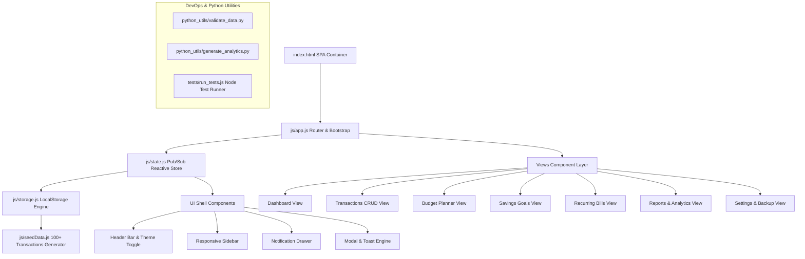

# BudgetWise — Personal Finance & Budget Management SaaS

**BudgetWise** is a production-quality, enterprise-grade Personal Finance & Budget Management SaaS web application built with modern ES6+ JavaScript, HTML5, CSS3, and Python 3.10+ utility scripts.

Featuring a zero-backend LocalStorage architecture with automatic data seeding, dark/light theme switching, live financial health index calculation, category budget tracking, savings goal progress, recurring bills engine, and Python statistical analytics.

---

## 🌟 Key Features

- **Demo Account & Auto-Seeding**: Auto-populates **100+ realistic financial transactions** across 12 months, 8 expense categories, 4 monthly budgets, and 5 savings goals for `demo@budgetwise.com` (`Demo@123`).
- **Interactive Financial Dashboard**: Live KPIs (Net Balance, Monthly Income, Monthly Expense, Savings Rate), 6-month cash flow chart, top category outflows, and Financial Health Score index (0–100 gauge).
- **Income & Expense CRUD**: Full transaction management with live search, date range filter, category filter, multi-column sorting, pagination, and CSV exporter.
- **Category Budget Planner**: Set monthly target caps for Food, Travel, Shopping, Bills, Healthcare, Education, Entertainment, and Utilities. Visual progress bars with 80% warning and 100% overflow alerts.
- **Savings Goals Tracker**: Interactive target tracking with milestone dates, deposit/withdrawal handlers, and target completion progress indicators.
- **Recurring Bills Engine**: Auto-scheduling for rent, broadband, subscriptions, and paychecks with 1-click payment posting.
- **Theme & Multi-Currency System**: Smooth Dark/Light mode theme engine + support for USD ($), EUR (€), GBP (£), and INR (₹).
- **Data Backup & Restore**: Full JSON database export, import validator, and 1-click clean demo data reset.

---

## 📐 Application Architecture



---

## 🚀 Quickstart & Setup Guide

### 1. Local Development Server
```bash
# Clone repository and enter directory
cd budgetwise

# Option A: Start using NPM
npm start

# Option B: Start using Makefile
make serve
```
Open your browser at `http://localhost:3000`.

### 2. Demo Account Login Credentials
- **Email**: `demo@budgetwise.com`
- **Password**: `Demo@123`
- *Or click the "Explore Demo Account" 1-click shortcut on the login page.*

---

## 🧪 Running Automated Tests

BudgetWise includes **6 automated test files** (5 JavaScript test modules + 1 Python test file).

### Run JavaScript Test Suite
```bash
# Run via NPM
npm test

# Or run directly via Node.js
node tests/run_tests.js
```

### Run Python Test Suite & Utilities
```bash
# Run Python Unit Tests
make test-python

# Run Data Validation Utility
make validate

# Run Analytics Statistical Processor
make analytics
```

---

## 🐳 Docker Deployment

BudgetWise includes a multi-stage Nginx Docker setup.

```bash
# Build Docker Image
make docker-build

# Run Container with Docker Compose (serves on port 8080)
make docker-run
```
Visit `http://localhost:8080` in your web browser.

---

## 🗂️ 5-Phase Git Commit Roadmap

1. **`feat/phase-1-core-setup`**: Project initialization, CSS design tokens, LocalStorage engine & 100+ items demo data seeder.
2. **`feat/phase-2-auth-shell`**: Auth manager, responsive sidebar/header navigation, theme toggle engine, and Modal/Toast components.
3. **`feat/phase-3-transactions-crud`**: Income & Expense CRUD table, live search, multi-category filters, sorting, and CSV exporter.
4. **`feat/phase-4-budgets-goals-recurring`**: Category budget planner, savings goals tracker, recurring bills scheduler, and notification drawer.
5. **`feat/phase-5-analytics-tests-devops`**: Dynamic financial health index, reports, Python 3.10 validation & analytics scripts, 6 automated test files, Dockerfile, Makefile & README.
"# budgetwise" 
